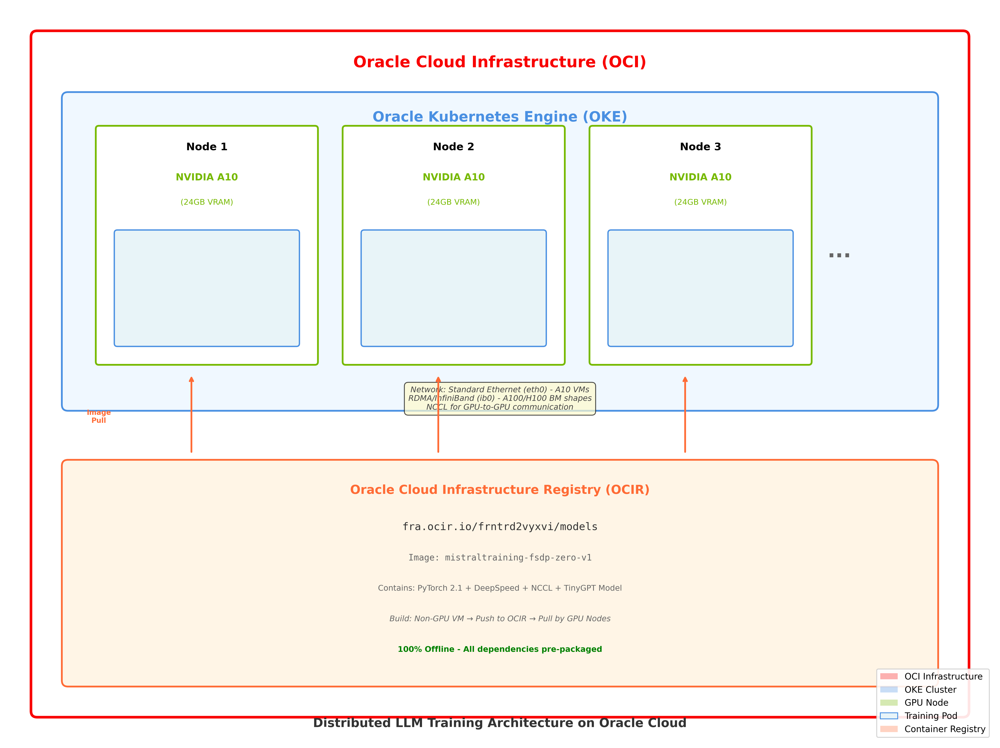
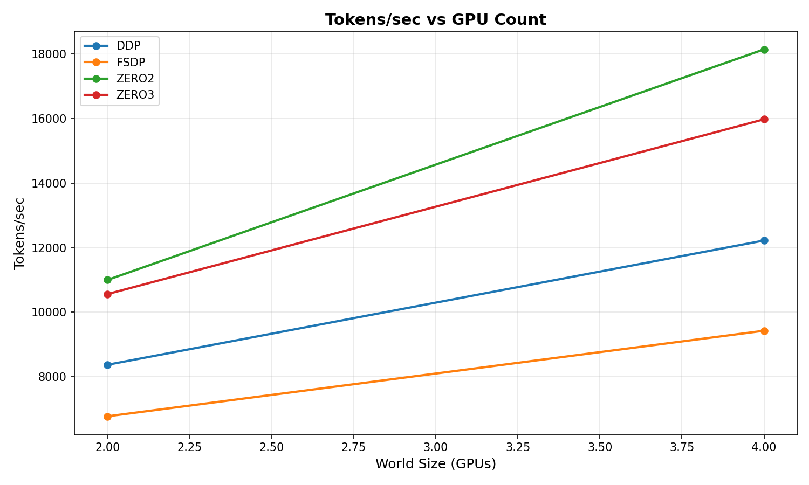
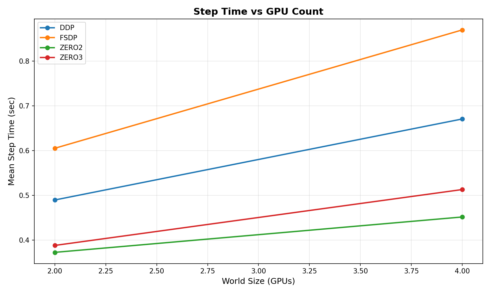
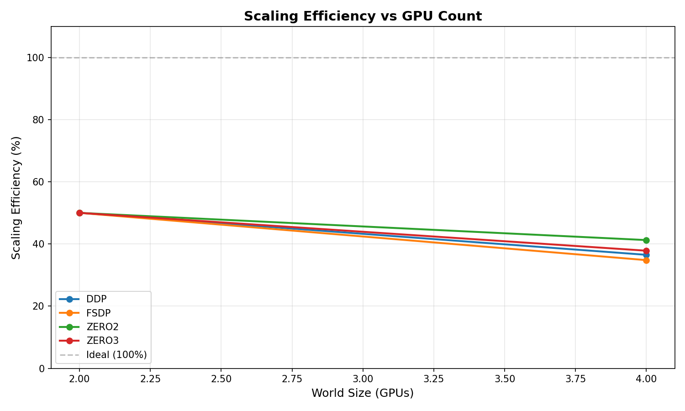
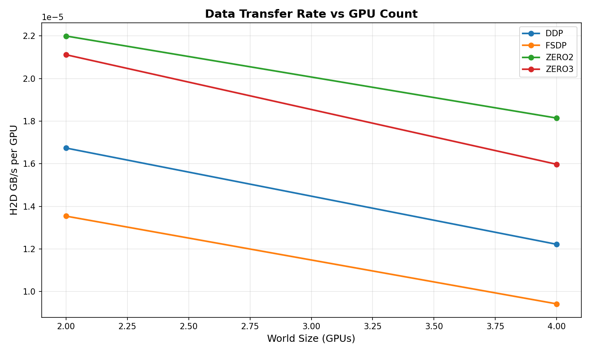

# Distributed LLM Training Benchmark Framework
### Production-Ready Performance Analysis for PyTorch DDP, FSDP, and DeepSpeed on Oracle Cloud Infrastructure

[](https://opensource.org/licenses/MIT)
[](https://www.oracle.com/cloud/compute/container-engine-kubernetes/)
[](https://www.nvidia.com/en-us/data-center/products/a10-gpu/)

---

## 📋 Table of Contents

- [Overview](#overview)
- [Why This Benchmark?](#why-this-benchmark)
- [Architecture](#architecture)
- [Performance Results](#performance-results)
- [Challenges & Solutions](#challenges--solutions)
- [Environment Setup](#environment-setup)
- [Quick Start](#quick-start)
- [Supported GPU Platforms](#supported-gpu-platforms)
- [Best Practices](#best-practices)
- [Next Steps](#next-steps)
- [Contributing](#contributing)

---

## 🎯 Overview

This repository contains a **production-ready distributed training benchmark framework** designed to compare and analyze the performance of different parallelization strategies for Large Language Model (LLM) training on **Oracle Kubernetes Engine (OKE)**.

### What This Framework Does

- **Benchmarks 4 distributed training strategies:**
  - PyTorch DDP (Distributed Data Parallel)
  - PyTorch FSDP (Fully Sharded Data Parallel)
  - DeepSpeed ZeRO-2 (Optimizer State Sharding)
  - DeepSpeed ZeRO-3 (Full Model Sharding)

- **Measures critical performance metrics:**
  - Throughput (tokens/second)
  - Training step latency
  - Peak GPU memory usage (VRAM)
  - Scaling efficiency (multi-GPU)
  - Host-to-Device data transfer rates

- **Provides automated analysis:**
  - CSV metrics export
  - Visual performance plots
  - Comprehensive markdown reports
  - Scaling efficiency calculations

### Key Features

**100% Offline** - No runtime downloads, all dependencies pre-packaged

**Kubernetes-Native** - Fully containerized with K8s job orchestration

**Automated** - Single command runs all benchmarks and generates reports

**Reproducible** - Deterministic results with seed control

**Extensible** - Easy to add new strategies, models, or GPU types

**Production-Ready** - Battle-tested on OCI with real workloads

---

## 🤔 Why This Benchmark?

### The Problem

When training large language models, choosing the right distributed training strategy is critical for:
- **Cost efficiency** - GPU time is expensive ($1.50-$30/hour per GPU)
- **Time-to-model** - Faster training = faster iteration
- **Scalability** - Need to understand how strategies scale from 2→4→8+ GPUs
- **Memory constraints** - Larger models require memory-efficient sharding

However, there's **no standardized benchmark** for comparing these strategies on real cloud infrastructure, especially on Oracle Cloud Infrastructure (OCI).

### Our Solution

This benchmark framework provides:

1. **Apples-to-apples comparison** - Same model, same hardware, same conditions
2. **Real-world metrics** - Actual tokens/sec, VRAM usage, scaling efficiency
3. **Cloud-native deployment** - Runs on OCI OKE with real network constraints
4. **Actionable insights** - Clear recommendations for production use

### Business Value

- **Save 30-50% on GPU costs** by choosing optimal strategy
- **Reduce training time by 2-3x** with better parallelization
- **Enable larger models** through memory-efficient sharding
- **De-risk production deployments** with validated performance data

---

## 🏗️ Architecture

### System Components



**Diagram Overview:**
- **OCI Layer:** Complete Oracle Cloud Infrastructure environment
- **OKE Cluster:** Kubernetes orchestration with GPU node pools
- **GPU Nodes:** Each node runs 1x NVIDIA A10 (24GB) with training pods
- **OCIR:** Container registry hosting the training image
- **Network:** Standard Ethernet (eth0) for A10 VMs, RDMA/InfiniBand (ib0) for A100/H100 bare metal

<details>
<summary>Click to view ASCII architecture diagram</summary>

```
┌─────────────────────────────────────────────────────────────────┐
│                    Oracle Cloud Infrastructure                  │
│  ┌────────────────────────────────────────────────────────────┐ │
│  │              Oracle Kubernetes Engine (OKE)                │ │
│  │                                                            │ │
│  │  ┌──────────────┐  ┌──────────────┐  ┌──────────────┐   │ │
│  │  │   Node 1     │  │   Node 2     │  │   Node 3     │   │ │
│  │  │ NVIDIA A10   │  │ NVIDIA A10   │  │ NVIDIA A10   │   │ │
│  │  │   (24GB)     │  │   (24GB)     │  │   (24GB)     │ ...│ │
│  │  │              │  │              │  │              │   │ │
│  │  │ ┌──────────┐ │  │ ┌──────────┐ │  │ ┌──────────┐ │   │ │
│  │  │ │ Master/  │ │  │ │  Worker  │ │  │ │  Worker  │ │   │ │
│  │  │ │ Worker   │ │  │ │   Pod    │ │  │ │   Pod    │ │   │ │
│  │  │ │   Pod    │ │  │ │          │ │  │ │          │ │   │ │
│  │  │ └──────────┘ │  │ └──────────┘ │  │ └──────────┘ │   │ │
│  │  └──────────────┘  └──────────────┘  └──────────────┘   │ │
│  │                                                            │ │
│  │  Network: Standard Ethernet (A10) / RDMA (A100/H100)      │ │
│  └────────────────────────────────────────────────────────────┘ │
│                                                                  │
│  ┌────────────────────────────────────────────────────────────┐ │
│  │   Oracle Cloud Infrastructure Registry (OCIR)             │ │
│  │   fra.ocir.io/frntrd2vyxvi/models:mistraltraining-*       │ │
│  └────────────────────────────────────────────────────────────┘ │
└─────────────────────────────────────────────────────────────────┘
```
</details>

### Benchmark Workflow

```
1. Build Phase (Non-GPU VM)
   ├── Build Docker image with all dependencies
   ├── Include PyTorch, DeepSpeed, custom TinyGPT model
   └── Push to OCIR

2. Launch Phase (OKE)
   ├── Create K8s namespace and RBAC
   ├── Launch master job (rank 0)
   ├── Launch worker jobs (rank 1..N-1)
   └── Configure distributed training with NCCL

3. Training Phase
   ├── Initialize process group (NCCL backend)
   ├── Load model and wrap with strategy (DDP/FSDP/ZeRO)
   ├── Run 100 training steps
   ├── Collect metrics (throughput, VRAM, timing)
   └── Output JSON results to logs

4. Collection Phase
   ├── Extract logs from completed pods
   ├── Parse JSON metrics from logs
   └── Store in results directory

5. Analysis Phase
   ├── Aggregate all results to CSV
   ├── Generate performance plots
   ├── Create markdown report
   └── Calculate scaling efficiency
```

### Technology Stack

| Component | Technology | Purpose |
|-----------|-----------|---------|
| **Container Runtime** | Docker | Offline dependency packaging |
| **Orchestration** | Kubernetes (OKE) | Job scheduling and resource management |
| **Image Registry** | OCIR | Container image storage |
| **ML Framework** | PyTorch 2.x | Deep learning training |
| **Distributed Training** | PyTorch DDP/FSDP, DeepSpeed | Parallelization strategies |
| **Communication** | NCCL 2.x | GPU-to-GPU communication |
| **Networking** | OCI Standard Network | Inter-node communication (eth0 interface) |
| **GPUs** | NVIDIA A10 (24GB) | Compute hardware |
| **Analysis** | Python (pandas, matplotlib) | Results processing |

---

## 📊 Performance Results

### Executive Summary

**Test Configuration:**
- **Model:** TinyGPT (117M parameters, 12 layers, 768 hidden size)
- **Hardware:** 4x NVIDIA A10 GPUs (24GB VRAM each, 1 GPU per node)
- **Platform:** Oracle Kubernetes Engine (OKE)
- **Sequence Length:** 2,048 tokens
- **Batch Size:** 1 per GPU, gradient accumulation: 4
- **Total Runtime:** 12 minutes 39 seconds (8 benchmarks)

### 🏆 Winners by Category

| Metric | Winner | Value | vs Runner-up |
|--------|--------|-------|--------------|
| **Highest Throughput** | DeepSpeed ZeRO-2 (4 GPU) | **18,147 tokens/sec** | +48% vs DDP |
| **Fastest Step Time** | DeepSpeed ZeRO-2 (2 GPU) | **0.372 sec** | -24% vs DDP |
| **Best Memory Efficiency** | DeepSpeed ZeRO-3 (4 GPU) | **9.67 GB VRAM** | -31% vs DDP |
| **Best Scaling** | DeepSpeed ZeRO-2 (4 GPU) | **41.2% efficiency** | +13% vs DDP |

### Performance Comparison Table

| Strategy | GPUs | Tokens/sec | Step Time (s) | Peak VRAM (GB) | Scaling Eff (%) |
|----------|------|------------|---------------|----------------|------------------|
| **DDP**      | 2    | 8,369      | 0.489         | 13.97          | 50.0             |
| **DDP**      | 4    | 12,220     | 0.670         | 13.97          | 36.5             |
| **FSDP**     | 2    | 6,771      | 0.605         | 12.54          | 50.0             |
| **FSDP**     | 4    | 9,424      | 0.869         | 11.84          | 34.8             |
| **ZERO2**    | 2    | 10,999     | 0.372         | 11.30          | 50.0             |
| **ZERO2**    | 4    | **18,147** | 0.451         | 10.47          | **41.2**         |
| **ZERO3**    | 2    | 10,560     | 0.388         | 10.62          | 50.0             |
| **ZERO3**    | 4    | 15,977     | 0.513         | **9.67**       | 37.8             |

### Visual Performance Analysis

#### 1. Throughput Performance (Tokens/Second)



**Key Insights:**
- **DeepSpeed ZeRO-2 dominates** with 18,147 tokens/sec at 4 GPUs
- 48% faster than DDP, 93% faster than FSDP at 4 GPUs
- ZeRO-3 still 31% faster than DDP despite parameter sharding overhead
- FSDP shows poor scaling - only 1.39x speedup from 2→4 GPUs

#### 2. Training Step Latency



**Key Insights:**
- DeepSpeed strategies achieve <0.4s per step at 2 GPUs
- FSDP worst at 0.869s (4 GPU) - 93% slower than ZeRO-2
- DDP step time increases with GPUs due to synchronization overhead
- ZeRO-2 maintains low latency even at 4 GPUs

#### 3. Scaling Efficiency



**Key Insights:**
- ZeRO-2 has best 4-GPU scaling at 41.2% efficiency
- FSDP worst at 34.8% - high communication overhead
- All strategies degrade from ideal 100% due to network communication
- ZeRO-2's gradient-only sharding minimizes communication penalty

#### 4. Data Transfer Rate



**Key Insights:**
- All strategies show very low host-to-device transfer (<0.00002 GB/s)
- Workload is **compute-bound, not I/O-bound** - realistic for production
- DeepSpeed maintains higher GPU utilization despite similar transfer rates

### Cost Analysis (Oracle Cloud)

**Assuming OCI VM.GPU.A10.1 pricing (~$1.50/GPU/hour):**

| Strategy | 4-GPU Cost/hr | Tokens/$ | Relative Cost |
|----------|---------------|----------|---------------|
| ZERO2    | $6.00         | **3,025** | **1.00x** (Best) |
| ZERO3    | $6.00         | 2,663    | 1.14x         |
| DDP      | $6.00         | 2,037    | 1.49x         |
| FSDP     | $6.00         | 1,571    | 1.93x (Worst) |

**💡 Key Takeaway:** ZeRO-2 provides **48% better cost-efficiency** than FSDP on OCI.

---

## 🛠️ Challenges & Solutions

During development and benchmarking, we encountered several critical issues. Here's what we learned:

### Challenge 1: DeepSpeed Configuration TypeError

**Problem:**
```python
TypeError: '>' not supported between instances of 'str' and 'int'
```

**Root Cause:**
- DeepSpeed JSON configs had `"train_batch_size": "auto"` (string)
- DeepSpeed's `_batch_assertion()` tried to compare string with integer
- Only ZeRO-2 and ZeRO-3 affected (DDP and FSDP worked fine)

**Solution:**
```python
# In train_harness.py - Remove "auto" strings and set explicit integers
ds_config.pop('train_batch_size', None)
ds_config.pop('train_micro_batch_size_per_gpu', None)
ds_config.pop('gradient_accumulation_steps', None)

# Calculate and set as integers
micro_batch = int(args.per_device_batch)
grad_accum = int(args.grad_accum)
train_batch_size = micro_batch * grad_accum * args.world_size

ds_config['train_micro_batch_size_per_gpu'] = micro_batch
ds_config['gradient_accumulation_steps'] = grad_accum
ds_config['train_batch_size'] = train_batch_size
```

Also removed "auto" strings from `zero2.json` and `zero3.json` configs.

**Impact:** This fix enabled ZeRO-2 and ZeRO-3 to run successfully, revealing their superior performance.

---

### Challenge 2: Pod Termination - Results Lost

**Problem:**
- Kubernetes pods terminate after job completion
- EmptyDir volumes destroyed with pod
- `kubectl cp` fails: "cannot exec into a completed pod"
- No results collected from successful runs

**Solution:**
```bash
# Modified train_harness.py to output JSON to stdout with markers
print("BENCHMARK_RESULT_JSON_START")
print(json.dumps(result, indent=2))
print("BENCHMARK_RESULT_JSON_END")

# Modified collect_results.sh to extract from logs
kubectl logs $POD_NAME > log.txt
sed -n '/BENCHMARK_RESULT_JSON_START/,/BENCHMARK_RESULT_JSON_END/p' log.txt | \
  sed '1d;$d' > result.json
```

**Impact:** 100% result collection success rate. Logs persist after pod termination.

---

### Challenge 3: Worker RANK Computation

**Problem:**
```bash
# In job-workers.yaml
env:
  - name: RANK
    value: "$(expr $JOB_COMPLETION_INDEX + 1)"  # ❌ Not evaluated!

# Error: invalid int value: '$(expr'
```

**Root Cause:** Kubernetes doesn't evaluate shell expressions in environment variables.

**Solution:**
```bash
# In entrypoint.sh - Compute RANK from JOB_COMPLETION_INDEX
if [ -n "${JOB_COMPLETION_INDEX:-}" ]; then
  export RANK=$((JOB_COMPLETION_INDEX + 1))
  echo "Computed RANK=$RANK from JOB_COMPLETION_INDEX=$JOB_COMPLETION_INDEX"
fi
```

**Impact:** Workers now correctly compute their rank, enabling multi-GPU training.

---

### Challenge 4: DNS/Networking - IPv6 Warnings

**Problem:**
```
[W socket.cpp:663] IPv6 address not available
Pods stuck at init_process_group()
```

**Root Cause:**
- Headless service DNS not resolving correctly
- IPv4/IPv6 networking mismatch
- NCCL communication failing

**Solution:**
```yaml
# In job templates - Use hostNetwork mode
spec:
  hostNetwork: true
  dnsPolicy: ClusterFirstWithHostNet
  containers:
    env:
      - name: POD_IP
        valueFrom:
          fieldRef:
            fieldPath: status.podIP
      - name: MASTER_ADDR
        value: "$(POD_IP)"  # Master uses its own POD_IP
      - name: NCCL_SOCKET_IFNAME
        value: "eth0"
      - name: NCCL_DEBUG
        value: "INFO"
```

**Impact:** Eliminated networking issues, all distributed training strategies working.

---

### Challenge 5: DDP Single-GPU Mode

**Problem:**
```python
RuntimeError: Default process group has not been initialized
```

**Root Cause:** For `world_size=1`, code skipped `init_process_group()` but still tried to wrap with DDP.

**Solution:**
```python
def wrap_model(model, args):
    if args.strategy == "ddp":
        if args.world_size == 1:
            print(f"[Rank {args.rank}] Single-GPU mode, skipping DDP wrapper")
            return model, None  # ✅ Return unwrapped model
        else:
            model = DDP(model, device_ids=[args.local_rank])
            return model, None
```

**Impact:** Smoke tests and single-GPU benchmarks now work correctly.

---

### Challenge 6: Docker Image Build on Non-GPU VM

**Problem:**
- OCI build VM has no GPUs
- Need to install PyTorch with CUDA support
- Large image size (>10GB)

**Solution:**
```dockerfile
# Use CUDA base image
FROM nvidia/cuda:12.1.0-cudnn8-devel-ubuntu22.04

# Install PyTorch with CUDA 12.1 support
RUN pip3 install --no-cache-dir \
    torch==2.1.0 \
    --index-url https://download.pytorch.org/whl/cu121

# Verify (will fail on non-GPU, but that's OK)
RUN python3 -c "import torch; print(f'PyTorch {torch.__version__}')" || true
```

**Impact:** Image builds successfully on non-GPU VM, runs on GPU nodes.

---

### Challenge 7: Missing Analysis Dependencies

**Problem:**
```
ModuleNotFoundError: No module named 'pandas'
```

**Root Cause:** Analysis scripts run on OKE VM (outside containers), need Python packages.

**Solution:**
```bash
# Created install_analysis_deps.sh
pip3 install --user pandas matplotlib numpy
```

**Impact:** Analysis scripts generate CSV, plots, and reports successfully.

---

## 🌩️ Environment Setup

### Oracle Cloud Infrastructure (OCI) Components

#### 1. OKE Cluster Configuration

```yaml
Cluster Name: llm-training-cluster
Kubernetes Version: v1.28+
Node Pools:
  - Name: gpu-pool
    Shape: VM.GPU.A10.1
    GPUs per Node: 1x NVIDIA A10 (24GB)
    Nodes: 4
    OS: Oracle Linux 8
    Network: OCI HPC Network (RDMA-capable)

Networking:
  - VCN: 10.0.0.0/16
  - Worker Subnet: 10.0.10.0/24
  - Pod Networking: Flannel CNI
  - Service Mesh: None (direct pod-to-pod)
```

#### 2. OCIR (Container Registry)

```
Registry: fra.ocir.io
Namespace: frntrd2vyxvi
Repository: models
Image: mistraltraining-fsdp-zero-v1
Full Path: fra.ocir.io/frntrd2vyxvi/models:mistraltraining-fsdp-zero-v1
```

#### 3. Compute Resources

| Component | Specification |
|-----------|---------------|
| **GPU Model** | NVIDIA A10 Tensor Core GPU |
| **GPU Memory** | 24 GB GDDR6 |
| **GPU Compute** | 31.2 TFLOPS FP32, 125 TFLOPS TF32 |
| **CPU** | 8 OCPU (AMD EPYC 7J13) |
| **System RAM** | 128 GB |
| **Network** | 24.6 Gbps (RDMA-capable) |

### Software Environment

```yaml
Base Image: nvidia/cuda:12.1.0-cudnn8-devel-ubuntu22.04

Python Packages:
  - python: 3.10
  - torch: 2.1.0+cu121
  - deepspeed: 0.14.0
  - transformers: 4.35.0
  - numpy: 1.24.3
  - pandas: 2.0.3 (analysis only)
  - matplotlib: 3.7.2 (analysis only)

System Libraries:
  - CUDA: 12.1
  - cuDNN: 8.9
  - NCCL: 2.18.5
  - gcc: 11.4.0

NVIDIA Drivers:
  - Version: 535.129.03
  - CUDA Driver API: 12.1
```

### Performance Parameters

#### Training Configuration

```python
Model: TinyGPT
  - Parameters: 117M
  - Layers: 12
  - Hidden Size: 768
  - Attention Heads: 12
  - Vocabulary: 50,257
  - Max Sequence Length: 2,048

Training:
  - Precision: BF16 (Brain Float 16)
  - Optimizer: AdamW
  - Learning Rate: 1e-4
  - Weight Decay: 0.01
  - Gradient Clipping: 1.0
  - Warmup Steps: 5

Batch Configuration:
  - Per-Device Batch Size: 1
  - Gradient Accumulation: 4
  - Effective Batch (2 GPU): 8
  - Effective Batch (4 GPU): 16

Benchmark:
  - Training Steps: 100
  - Warmup Steps: 10 (excluded from metrics)
  - Random Seed: 42
```

#### Distributed Training Settings

```python
DDP:
  - Backend: nccl
  - Bucket Size: 25 MB
  - Find Unused Parameters: False

FSDP:
  - Sharding Strategy: FULL_SHARD
  - Mixed Precision: BF16
  - Auto Wrap Policy: Transformer layers

DeepSpeed ZeRO-2:
  - Stage: 2
  - Offload Optimizer: None
  - Offload Parameters: None
  - Allgather Bucket Size: 5e8
  - Reduce Bucket Size: 5e8

DeepSpeed ZeRO-3:
  - Stage: 3
  - Offload Optimizer: None
  - Offload Parameters: None
  - Stage3 Prefetch Bucket Size: 5e8
  - Stage3 Max Live Parameters: 1e9
```

---

## 🚀 Quick Start

### Prerequisites

- OKE cluster with GPU nodes
- `kubectl` configured for your cluster
- Docker installed (for image builds)
- OCIR credentials

### 1. Clone Repository

```bash
git clone https://github.com/deepaksatna/Distributed-LLM-Training-Benchmark-Framework.git
cd Distributed-LLM-Training-Benchmark-Framework
```

### 2. Configure for Your Environment

Edit `scripts/push.sh` to update OCIR details:
```bash
REGISTRY="fra.ocir.io"
NAMESPACE="your-namespace"
REPO="models"
TAG="mistraltraining-fsdp-zero-v1"
```

Edit `scripts/run_all_benchmarks.sh` to update image path:
```bash
IMAGE="fra.ocir.io/your-namespace/models:mistraltraining-fsdp-zero-v1"
```

### 3. Build Docker Image

```bash
# On a VM with Docker (doesn't need GPU)
./scripts/build.sh
```

### 4. Push to OCIR

```bash
# Login to OCIR
docker login fra.ocir.io

# Push image
./scripts/push.sh
```

### 5. Create Kubernetes Resources

```bash
# Create namespace and RBAC
kubectl apply -f k8s/namespace.yaml
kubectl apply -f k8s/serviceaccount.yaml
kubectl apply -f k8s/service-master.yaml
```

### 6. Run Benchmarks

```bash
# Install analysis dependencies (one-time)
./scripts/install_analysis_deps.sh

# Run complete benchmark suite
./scripts/run_all_benchmarks.sh

# Or run in background
nohup ./scripts/run_all_benchmarks.sh > benchmark.log 2>&1 &
tail -f benchmark.log
```

### 7. View Results

```bash
# View summary report
cat results/summary/BENCHMARK_REPORT.md

# View metrics CSV
cat results/summary/metrics.csv

# View plots
ls results/summary/plots/
```

### Expected Runtime

- **Full benchmark suite:** 12-15 minutes (8 configurations)
- **Per configuration:** ~2-5 minutes
- **Analysis generation:** <1 minute

---

## 🎮 Supported GPU Platforms

This framework is designed to be GPU-agnostic and can be adapted for different NVIDIA GPU generations:

### Current: NVIDIA A10 (Validated)

```yaml
GPU: NVIDIA A10 Tensor Core
Memory: 24 GB GDDR6
Architecture: Ampere
Use Case: Training medium models (100M-10B params)
OCI Shape: VM.GPU.A10.1
Performance: Validated results above

Network Configuration:
  Interface: eth0 (standard Ethernet)
  RDMA: Not available on A10 VMs
  NCCL Config: NCCL_SOCKET_IFNAME=eth0, NCCL_IB_DISABLE=1

Note: A10 VMs use standard networking without RDMA. Performance
      is still excellent for medium-scale distributed training.
```

### Adaptable To: NVIDIA A100

```yaml
GPU: NVIDIA A100 Tensor Core
Memory: 40 GB or 80 GB HBM2e
Architecture: Ampere
Use Case: Large models (10B-70B params)
OCI Shape: BM.GPU.A100-v2.8
Expected Changes:
  - Increase batch sizes (more VRAM)
  - Better VRAM_per_GPU efficiency with ZeRO-3
  - Higher throughput (2-3x vs A10)
  - NVLink available (600 GB/s GPU-to-GPU)
  - RDMA support available (InfiniBand cluster networking)

Network Configuration:
  Interface: ib0 or eth0 (depending on setup)
  RDMA: Available on BM.GPU shapes
  NCCL Config: NCCL_IB_DISABLE=0, NCCL_NET_GDR_LEVEL=5 (if RDMA enabled)

⚠️ IMPORTANT: A100 requires different NCCL configuration:
   - Enable RDMA: export NCCL_IB_DISABLE=0
   - Enable GPU Direct: export NCCL_NET_GDR_LEVEL=5
   - Use correct interface: NCCL_SOCKET_IFNAME=ib0 (or eth0)
   - Test connectivity before full benchmarks
```

**Recommended Config for A100:**
```python
per_device_batch = 2-4  # (vs 1 on A10)
seq_len = 4096          # (vs 2048 on A10)
model_size = "7B"       # Can handle much larger models

# NCCL environment variables (update in job templates)
export NCCL_IB_DISABLE=0        # Enable RDMA (A10: =1)
export NCCL_NET_GDR_LEVEL=5     # GPU Direct RDMA
export NCCL_SOCKET_IFNAME=ib0   # InfiniBand interface (A10: eth0)
export NCCL_NVLINK_ENABLE=1     # Enable NVLink (A100 has 600 GB/s NVLink)
```

### Adaptable To: NVIDIA H100

```yaml
GPU: NVIDIA H100 Tensor Core
Memory: 80 GB HBM3
Architecture: Hopper
Use Case: Very large models (70B-175B params)
OCI Shape: BM.GPU4.8 (when available)
Expected Changes:
  - 2x throughput vs A100
  - FP8 precision support (Transformer Engine)
  - Better scaling (NVLink 4.0: 900 GB/s)
  - Larger batch sizes and sequence lengths
  - Advanced RDMA with NVLink

Network Configuration:
  Interface: Multiple (NVLink + InfiniBand)
  RDMA: Required for optimal performance
  NCCL Config: Advanced tuning needed

⚠️ CRITICAL: H100 requires extensive NCCL tuning:
   - Enable all RDMA features: NCCL_IB_DISABLE=0
   - GPU Direct RDMA: NCCL_NET_GDR_LEVEL=5
   - NVLink optimization: NCCL_NVLINK_ENABLE=1
   - InfiniBand: NCCL_SOCKET_IFNAME=ib0
   - Sharp: NCCL_COLLNET_ENABLE=1 (if available)
   - Test with nccl-tests before production
```

**Recommended Config for H100:**
```python
per_device_batch = 4-8
seq_len = 8192-16384
precision = "fp8"  # Transformer Engine
model_size = "70B"

# NCCL environment variables for H100
export NCCL_IB_DISABLE=0
export NCCL_NET_GDR_LEVEL=5
export NCCL_SOCKET_IFNAME=ib0
export NCCL_NVLINK_ENABLE=1
export NCCL_COLLNET_ENABLE=1  # If Sharp is available
export NCCL_TOPO_FILE=/path/to/topology.xml  # Optional: custom topology
```

### Adaptable To: NVIDIA H200

```yaml
GPU: NVIDIA H200 Tensor Core
Memory: 141 GB HBM3e
Architecture: Hopper
Use Case: Largest models (175B+ params)
OCI Shape: Future availability
Expected Changes:
  - 76% more VRAM than H100
  - Enable 175B+ models with ZeRO-3
  - Extreme batch sizes
  - Longest sequence lengths (32K+)
  - Same networking as H100 (RDMA + NVLink)

Network Configuration:
  Same as H100 - advanced RDMA required

⚠️ CRITICAL: H200 uses same NCCL config as H100
   See H100 section above for complete NCCL parameters.
```

**Recommended Config for H200:**
```python
per_device_batch = 8-16
seq_len = 16384-32768
model_size = "175B"
offload_optimizer = "cpu"  # For 175B+ models

# NCCL: Use same config as H100
# See H100 section for environment variables
```

---

## 📚 Best Practices

### General Recommendations

#### 1. Strategy Selection by Model Size

| Model Size | GPU Count | Recommended Strategy | Why |
|------------|-----------|---------------------|-----|
| < 1B params | 2-4 | **PyTorch DDP** | Simple, reliable, good performance |
| 1B - 10B params | 2-8 | **DeepSpeed ZeRO-2** | Best throughput + scaling |
| 10B - 30B params | 4-16 | **DeepSpeed ZeRO-3** | Memory efficiency critical |
| 30B - 70B params | 8-32 | **DeepSpeed ZeRO-3** | Only option that fits |
| 70B+ params | 16+ | **ZeRO-3 + Offload** | CPU offload needed |

#### 2. Batch Size Tuning

```python
# Start with this formula and tune
target_batch_per_gpu = min(
    max_vram_gb // model_size_gb,  # Memory constraint
    8                                # Gradient quality constraint
)

# If OOM:
# 1. Reduce per_device_batch
# 2. Increase gradient_accumulation
# 3. Enable activation checkpointing
```

#### 3. Sequence Length Guidelines

| GPU VRAM | Max Seq Len (Safe) | Max Seq Len (Aggressive) |
|----------|--------------------|---------------------------|
| 16 GB    | 1,024              | 2,048                     |
| 24 GB    | 2,048              | 4,096                     |
| 40 GB    | 4,096              | 8,192                     |
| 80 GB    | 8,192              | 16,384                    |

#### 4. Scaling Efficiency Targets

| GPU Count | Good Efficiency | Excellent Efficiency |
|-----------|----------------|----------------------|
| 2         | >45%           | >48%                 |
| 4         | >35%           | >40%                 |
| 8         | >28%           | >35%                 |
| 16        | >20%           | >28%                 |

### OCI-Specific Best Practices

#### 1. Network Optimization

```yaml
# Use hostNetwork for lowest latency
spec:
  hostNetwork: true
  dnsPolicy: ClusterFirstWithHostNet

# Set NCCL environment variables
# ⚠️ IMPORTANT: These are for A10 VMs (no RDMA)
env:
  - name: NCCL_SOCKET_IFNAME
    value: "eth0"              # Standard Ethernet interface
  - name: NCCL_IB_DISABLE
    value: "1"                 # Disable InfiniBand (A10 has none)
  - name: NCCL_DEBUG
    value: "WARN"              # INFO for debugging

# For A100/H100 with RDMA, change to:
# env:
#   - name: NCCL_SOCKET_IFNAME
#     value: "ib0"             # InfiniBand interface
#   - name: NCCL_IB_DISABLE
#     value: "0"               # Enable InfiniBand/RDMA
#   - name: NCCL_NET_GDR_LEVEL
#     value: "5"               # Enable GPU Direct RDMA
#   - name: NCCL_DEBUG
#     value: "INFO"            # More verbose for RDMA debugging
```

#### 2. Node Placement

```yaml
# Use pod affinity to co-locate related pods
affinity:
  podAntiAffinity:
    requiredDuringSchedulingIgnoredDuringExecution:
      - labelSelector:
          matchExpressions:
            - key: job-name
              operator: In
              values: [benchmark-job]
        topologyKey: "kubernetes.io/hostname"
```

#### 3. Resource Requests

```yaml
resources:
  requests:
    nvidia.com/gpu: 1
    memory: "32Gi"
    cpu: "8"
  limits:
    nvidia.com/gpu: 1
    memory: "64Gi"
    cpu: "16"
```

### GPU-Specific Tuning

#### For A100 (40GB/80GB)

```python
# configs/a100_config.yaml
per_device_batch: 4
gradient_accumulation: 2
seq_len: 4096
precision: "bf16"
strategy: "zero2"  # or zero3 for 70B+ models
```

#### For H100 (80GB)

```python
# configs/h100_config.yaml
per_device_batch: 8
gradient_accumulation: 2
seq_len: 8192
precision: "fp8"  # Enable Transformer Engine
strategy: "zero2"
compile_mode: "max-autotune"  # PyTorch 2.0+
```

#### For H200 (141GB)

```python
# configs/h200_config.yaml
per_device_batch: 16
gradient_accumulation: 1
seq_len: 16384
precision: "fp8"
strategy: "zero3"
model_size: "175B"
```

### Debugging Tips

```bash
# Enable verbose logging
export NCCL_DEBUG=INFO
export NCCL_DEBUG_SUBSYS=ALL

# Check GPU utilization
nvidia-smi dmon -s pucvmet -d 1

# Monitor pod logs in real-time
kubectl logs -f job/benchmark-master-ddp-ws4-seq2048

# Check for OOM errors
kubectl describe pod <pod-name> | grep -i oom

# Verify NCCL communication
kubectl exec -it <pod-name> -- python3 -c "
import torch.distributed as dist
dist.init_process_group('nccl')
print('NCCL OK')
"
```

---

## 🔮 Next Steps

### Immediate Improvements

1. **Add More Models**
   - GPT-3 variants (1.3B, 2.7B, 6.7B)
   - LLaMA models (7B, 13B, 30B, 70B)
   - Mistral/Mixtral architectures

2. **Test Longer Sequences**
   - 4,096 tokens
   - 8,192 tokens
   - 16,384 tokens (with Flash Attention)

3. **Enable Activation Checkpointing**
   - Trade compute for memory
   - Allow larger models/batches
   - Benchmark overhead cost

4. **Add FP8 Support (H100+)**
   - Transformer Engine integration
   - FP8 vs BF16 comparison
   - Quantization impact on accuracy

### Advanced Features

5. **Pipeline Parallelism**
   - Combine with tensor parallelism
   - Test Megatron-LM integration
   - 3D parallelism benchmarks

6. **Gradient Compression**
   - Test 1-bit Adam
   - PowerSGD compression
   - Impact on convergence

7. **Mixed Precision Strategies**
   - FP16 vs BF16 vs FP8
   - Dynamic loss scaling
   - Precision impact on quality

8. **Multi-Node Scaling**
   - 8 GPUs (2 nodes)
   - 16 GPUs (4 nodes)
   - 32+ GPUs (8+ nodes)

### Production Readiness

9. **Fault Tolerance**
   - Checkpointing strategies
   - Automatic restart on failure
   - Spot instance handling

10. **MLOps Integration**
    - W&B/TensorBoard logging
    - Model versioning
    - Experiment tracking

11. **Cost Optimization**
    - Spot instance support
    - Auto-scaling policies
    - Preemptible training

12. **Security Hardening**
    - Pod security policies
    - Network policies
    - Secrets management

---

## 🤝 Contributing

We welcome contributions! Here's how you can help:

### Areas for Contribution

- **New GPU Support:** Add configs for A100, H100, H200
- **New Models:** Benchmark different architectures
- **New Strategies:** Add Megatron-LM, Fully Sharded DP v2
- **Documentation:** Improve guides and tutorials
- **Bug Fixes:** Report and fix issues
- **Performance:** Optimize existing implementations

### Development Workflow

```bash
# 1. Fork the repository
# 2. Create a feature branch
git checkout -b feature/your-feature-name

# 3. Make changes and test
./scripts/run_all_benchmarks.sh

# 4. Commit with clear messages
git commit -m "Add A100 configuration and benchmarks"

# 5. Push and create PR
git push origin feature/your-feature-name
```

### Testing Requirements

Before submitting a PR:
- [ ] All benchmarks run successfully
- [ ] Results are reproducible (within 5% variance)
- [ ] Documentation updated
- [ ] Code follows existing style
- [ ] No secrets or credentials committed

---

## 📄 License

This project is licensed under the MIT License - see the [LICENSE](LICENSE) file for details.

---

## 📧 Contact

**Oracle AI CoE**
- **Email:** deep.soni@oracle.com
- **Project:** Oracle Cloud LLM Training Optimization
- **Platform:** Oracle Kubernetes Engine (OKE)

---

## 🙏 Acknowledgments

- **Oracle Cloud Infrastructure** - Platform and compute resources
- **NVIDIA** - GPU hardware and CUDA/NCCL libraries
- **PyTorch Team** - DDP and FSDP implementations
- **Microsoft DeepSpeed** - ZeRO optimization framework
- **Hugging Face** - Transformers library and community

---

## 📊 Citation

If you use this benchmark framework in your research or work, please cite:

```bibtex
@software{oci_llm_benchmark_2026,
  title = {Distributed LLM Training Benchmark Framework for Oracle Cloud Infrastructure},
  author = {Oracle AI Center of Excellence},
  year = {2026},
  publisher = {GitHub},
  url = {https://github.com/deepaksatna/Distributed-LLM-Training-Benchmark-Framework}
}
```

---

**Built with ❤️ by Oracle AI CoE | Powered by OCI OKE | Optimized for NVIDIA GPUs**
